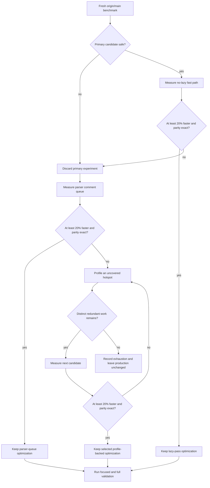

# No-Op Lazy Pass Elision - Plan

## Goal Capsule

- **Objective:** Large TSRX modules compile faster without changing generated
  artifacts or lazy-destructuring behavior.
- **Means:** Profile a fixed corpus first, then elide provably empty
  lazy-destructuring work, try a distinct parser-queue fallback if needed, and
  continue to new profile-backed candidates until one ships or the corpus contains
  no uncovered redundant hotspot (KTD1, KTD2, KTD3).
- **Authority:** The user request and the current `origin/main` source at
  `bb8d919` outrank this plan. Existing compiler output and public API behavior
  outrank the optimization.
- **Execution profile:** Profile and measure first. If a candidate fails, revert
  it completely and continue with a distinct profile-backed hypothesis. Keep only
  one optimization that clears the preset performance bar and all parity gates.
- **Stop conditions:** Do not ship a candidate that overlaps recent performance
  PRs, changes output, weakens lazy handling, changes a public helper contract, or
  misses the performance threshold.
- **Tail ownership:** If a candidate ships, the implementation run owns benchmark
  evidence, focused and full validation, the patch changeset, and removal of every
  abandoned experiment. If none ships, it owns the recorded exhaustion evidence
  and an unchanged production diff.

---

## Product Contract

### Summary

This plan searches for and removes redundant compiler work. It measures a
lazy-pass fast path first, switches to a parser comment-queue optimization if
needed, and continues from a representative profile if neither named candidate
matters enough to ship.

### Problem Frame

Every non-type-only compile currently scans the AST for lazy destructuring before
the main JSX transform, scans the lowered AST again, and then invokes the
recursive lazy rewrite. Ordinary modules without `&{}` or `&[]` cannot benefit
from the latter work. The first scan already computes whether any lazy pattern
exists, but discards that result.

The optimization must be selected with measurements rather than static
plausibility. Recent performance work already optimized location-free AST cloning,
parameter-comment line calculation, export-scope lookup, Volar keyword-token
lookup, and statement-position analysis. PR #19 also records a rejected Prettier
blank-line membership experiment. This run must not repeat any of those attempts.

### Requirements

**Performance selection**

- R1. Profile a fixed corpus of the repository's four large Vite runtime fixtures
  before selecting a candidate, then benchmark each candidate against
  `origin/main` with fresh inputs and identical runtime options before editing its
  production path.
- R2. Ship only a candidate whose five fresh-process candidate samples have a
  median no greater than 80% of the five-sample control median and whose slowest
  candidate sample is faster than the fastest control sample. Require an
  improvement on both the candidate's fixed stress fixture and the representative
  corpus's aggregate end-to-end time.
- R3. If the primary candidate fails its safety or performance gate, remove that
  experiment and evaluate the parser comment-queue fallback. If the fallback also
  fails, continue with distinct profile-backed candidates under U4 rather than
  stopping after an arbitrary candidate count.
- R4. If a candidate clears every gate, finish with that one optimization only.
  Abandoned candidates and scratch benchmark code must not remain in the branch
  diff.

**Behavioral parity**

- R5. Preserve byte-identical generated code, source-map data, CSS, and CSS hash
  for the selected benchmark corpus.
- R6. Preserve equivalent diagnostics and normalized returned AST data for the
  selected benchmark corpus.
- R7. Preserve all current lazy-destructuring behavior for authored lazy patterns,
  pre-stamped patterns, nested directive lowering, and type-only compilation.
- R8. Preserve the runtime and inferred TypeScript contracts of the public
  `preallocateLazyIds` and `getCommentHandlers` helpers.

**Scope control**

- R9. Base the work on `origin/main` at `bb8d919` in the isolated
  `lfg-perf-hunt-3` worktree.
- R10. Do not modify the areas or repeat the hypotheses covered by recent
  performance PRs #3, #5, #7, #17, and #19.
- R11. If a candidate ships, add a patch changeset for the affected published
  package and describe only the measured performance improvement. If the search is
  exhausted without a qualifying candidate, leave production code and changesets
  unchanged.

### Acceptance Examples

- AE1. **Covers R5, R6, R7.** Given a large module with no lazy syntax, when the
  selected compiler fast path runs, then all emitted artifacts and normalized AST
  data match the control revision.
- AE2. **Covers R7.** Given lazy destructuring inside a nested `@{}` block or
  directive body, when the compiler lowers the module, then generated lazy
  identifiers and rewritten member accesses match the control revision.
- AE3. **Covers R2, R3, R4.** Given a primary benchmark below the preset bar or a
  failed hook-safety audit, when the implementation run evaluates the result, then
  it deletes the experiment and moves to the parser queue without lowering the
  bar; if that also fails, it returns to the profile for a distinct candidate.
- AE4. **Covers R8.** Given a direct consumer of either public helper, when the
  optimization ships, then the helper's return and repeated-call behavior remain
  unchanged.

### Scope Boundaries

In scope:

- One measured, semantics-preserving performance improvement in the TSRX
  workspace.
- Focused regression coverage for the selected path.
- A patch changeset and benchmark evidence suitable for the PR description.

Outside scope:

- The recent AST clone, comment-location, export-scope, Volar token, and
  statement-position optimizations.
- The Prettier blank-line membership candidate already rejected during PR #19.
- Public compiler API redesign, new dependencies, persistent benchmark
  infrastructure, and unrelated cleanup.

---

## Planning Contract

### Key Technical Decisions

- KTD1. **Treat the existing lazy scan result as the primary fast-path signal only
  where post-scan synthesis is impossible.** Add an internal result-bearing scan
  while keeping the public `preallocateLazyIds` wrapper's `void` contract. The
  bundled platform descriptors may take the negative fast path only after their
  hooks are proven unable to synthesize lazy patterns. Custom or otherwise
  unproven hook-bearing descriptors retain the established second scan and rewrite
  path.
- KTD2. **Decide with a preset corpus and mechanism benchmark.** First profile and
  measure the checked-in React, Preact, Solid, and Vue Vite runtime fixtures as a
  fixed representative corpus. Then measure the candidate's targeted stress
  fixture and its transform-only path with fresh inputs. R2 owns the shipping
  threshold on both end-to-end corpus and stress-fixture data; transform-only data
  explains the result but does not lower that threshold.
- KTD3. **Use parser comment consumption as the distinct fallback.** If KTD1 is
  unsafe or misses R2, replace repeated front-removal from the private attachment
  queue with constant-time consumption while preserving the exported
  `getCommentHandlers` contract and every existing attachment branch.
- KTD4. **Keep lazy-positive behavior on the established path.** When lazy syntax
  exists, retain the second post-lowering scan because generated IIFEs and
  directive callbacks need `metadata.has_lazy_descendants` before
  `applyLazyTransforms` runs.
- KTD5. **Compare semantic digests, not visual samples.** Benchmark validation
  includes code, map, CSS, CSS hash, diagnostics, and a stable normalization of
  the returned AST so a faster but structurally different result cannot pass
  unnoticed.

### High-Level Technical Design

### Assumptions

- Bundled JSX platform descriptors are expected to treat the parser's `lazy`
  marker as input syntax. U1 must verify each descriptor before enabling its fast
  path; custom or unproven hook-bearing descriptors remain on the established
  path.
- The checked-in React, Preact, Solid, and Vue Vite runtime fixtures form the
  representative corpus because they are the repository's largest authored TSRX
  programs and exercise distinct platform transforms. Purpose-built fixtures
  remain mechanism stress tests, not proxies for real-world value.
- If the fallback runs, comment callbacks do not interleave with one
  `add_comments` traversal. Repeated `onComment` and `add_comments` calls before
  or after a traversal must still behave as they do on `origin/main`.

### Risks and Mitigations

- **False-negative lazy gate:** A platform hook could introduce parser-native lazy
  metadata after the initial scan. U1 audits each bundled descriptor and preserves
  the established second scan for every custom or unresolved hook-bearing
  descriptor.
- **Mutated benchmark inputs:** Compiler passes stamp metadata and rebuild AST
  branches. U1 prepares a fresh parse or clone for every timed sample and keeps
  setup outside transform-only timing.
- **Diluted or noisy results:** Parsing and printing can hide transform gains.
  KTD2 records corpus, stress-fixture, and isolated measurements, while R2
  requires complete separation between the five-sample control and candidate
  distributions on both public-path datasets.
- **Fallback queue drift:** Comment attachment contains indexed lookahead, suffix
  scans, and repeated-call behavior. U3 adds direct helper tests and an exact
  AST/comment digest before changing consumption order.

### Sources and Research

- `packages/tsrx/src/transform/lazy.js` computes and propagates a subtree `found`
  result in `preallocate_lazy_ids` but currently discards the root result.
- `packages/tsrx/src/transform/jsx/index.js` invokes lazy preallocation before the
  main walk, repeats it after lowering, and always calls `apply_lazy_transforms`
  for non-type-only output.
- `packages/tsrx/src/plugin.js` is the only current source location that sets
  `lazy = true`; U1 must also audit target hooks before treating that observation
  as a compiler invariant.
- `packages/tsrx/src/parse/index.js` consumes the private comment-attachment queue
  with repeated `Array.shift()` calls, which is the fallback's redundant-work
  target.
- No `docs/solutions/` learning corpus or `CONCEPTS.md` exists in this repository.
  Current source, tests, and recent PR history are the planning authority.

---

## Implementation Units

### U1. Establish the benchmark and safety gate

- **Goal:** Decide whether the primary lazy-pass candidate is eligible before
  modifying production behavior.
- **Requirements:** R1, R2, R5, R6, R7, R9, R10; KTD1, KTD2, KTD5.
- **Dependencies:** None.
- **Files:** `packages/tsrx/src/transform/jsx/index.js`,
  `packages/tsrx/src/transform/lazy.js`, `packages/tsrx-react/src/transform.js`,
  `packages/tsrx-preact/src/transform.js`, `packages/tsrx-solid/src/transform.js`,
  `packages/tsrx-vue/src/transform.js` (inspection and benchmark inputs; no
  committed change expected yet).
- **Approach:**
  1. Confirm the worktree HEAD and control revision both resolve to `bb8d919`
     before measurements.
  2. Measure and profile the checked-in Vite runtime fixtures for React, Preact,
     Solid, and Vue as one aggregate corpus, using the owning compiler for each
     file.
  3. Audit each bundled platform hook, every compiler write to `lazy` metadata,
     and the public custom-platform hook surface. Mark only descriptors whose
     post-scan hooks cannot synthesize lazy patterns as eligible; all unproven and
     custom hook-bearing descriptors retain the current path.
  4. Build an untracked deterministic no-lazy stress fixture with many ordinary
     AST nodes. Use the same virtual filename, options, Node version, and package
     entry point for control and candidate runs.
  5. Record five fresh-process corpus samples, five fresh-process stress-fixture
     samples, and five transform-only samples. Prepare a new AST outside each
     transform-only timed interval.
  6. Record complete semantic digests for the artifacts named by KTD5 and preserve
     the control data for the selected candidate's final comparison.
- **Execution note:** Measure the untouched control before editing production
  code. If the safety audit fails, skip U2 and proceed directly to U3.
- **Patterns to follow:** The isolated-process median and semantic-digest evidence
  used in recent TSRX performance PRs, without reusing their hypotheses.
- **Test scenarios:**
  - The four checked-in Vite runtime fixtures produce stable aggregate timing
    samples and repeatable per-file semantic digests across fresh processes.
  - A large no-lazy React compile produces stable timing samples and one
    repeatable semantic digest across fresh processes.
  - A transform-only run receives a fresh AST for every sample and produces the
    same digest as the end-to-end fixture's transform stage.
  - Each bundled platform is checked for post-scan lazy-pattern synthesis, and a
    custom hook that synthesizes a lazy pattern proves that unproven hook-bearing
    descriptors retain the established path.
- **Verification:** The baseline table, runtime versions, fixture shape, semantic
  digest, hook audit, and go/no-go decision are recorded for the PR narrative. No
  benchmark-only file is staged.

### U2. Elide no-op lazy work

- **Goal:** Skip redundant post-lowering lazy work for modules proven to contain
  no lazy pattern.
- **Requirements:** R2, R3, R4, R5, R6, R7, R8, R11; KTD1, KTD2, KTD4, KTD5.
- **Dependencies:** U1 must approve the safety gate.
- **Files:** `packages/tsrx/src/transform/lazy.js`,
  `packages/tsrx/src/transform/jsx/index.js`,
  `packages/tsrx/tests/utils/lazy-pass-gating.test.js`,
  `.changeset/<generated-perf-name>.md`.
- **Approach:**
  1. Extract an internal result-bearing preallocation path and keep the public
     wrapper's current return behavior.
  2. Carry the first scan's presence result through the transform and bypass the
     second scan plus lazy rewrite only for the proven no-lazy branch of an
     eligible bundled descriptor.
  3. Keep the established second scan and rewrite for public custom descriptors
     with AST-producing hooks, including a regression where a hook synthesizes a
     lazy pattern after the first scan.
  4. Leave type-only flow and the lazy-positive second-scan path unchanged.
  5. Re-run U1's benchmark and parity corpus. Delete the implementation and
     continue to U3 if R2 or any parity requirement fails.
- **Execution note:** Add characterization coverage for the detection contract
  before changing the compiler branch.
- **Patterns to follow:** `preallocate_lazy_ids`'s existing recursive `found`
  propagation and the copy-on-write conventions in
  `packages/tsrx/src/transform/jsx/index.js`.
- **Test scenarios:**
  - A plain AST reports no internal lazy presence while the public
    `preallocateLazyIds` call still returns `undefined`.
  - A new lazy object or array pattern reports presence and receives the same
    stable ID as the control.
  - A previously stamped lazy pattern still reports presence without allocating a
    second ID.
  - Lazy patterns inside nested code blocks and `@if`, `@for`, `@switch`, and
    `@try` bodies retain their control output across all four target compilers.
  - A public custom platform hook that introduces a lazy pattern after the first
    scan receives the same allocation and rewrite as the control.
  - Type-only compilation does not invoke the production lazy rewrite and remains
    byte-identical to the control.
  - A large no-lazy module clears R2 and matches every semantic digest from U1.
- **Verification:** Focused detection tests pass, all shared lazy suites pass
  across React, Preact, Solid, and Vue, the public helper contract is unchanged,
  and the final benchmark clears R2.

### U3. Optimize parser comment consumption if the primary candidate fails

- **Goal:** Replace quadratic front-removal in comment attachment with linear
  queue consumption without changing parser behavior.
- **Requirements:** R1, R2, R3, R4, R5, R6, R8, R11; KTD2, KTD3, KTD5.
- **Dependencies:** U1 rejects U2, or U2 fails its post-change benchmark or parity
  gate.
- **Files:** `packages/tsrx/src/parse/index.js`,
  `packages/tsrx/tests/utils/parser.test.js`,
  `.changeset/<generated-perf-name>.md`.
- **Approach:**
  1. Benchmark a deterministic comment-heavy module against the untouched control
     before modifying the parser.
  2. Replace repeated head shifts with constant-time private queue consumption
     while preserving logical order, indexed lookahead, suffix scans, and the
     closure's state between calls.
  3. Preserve direct `getCommentHandlers` behavior, including multiple `onComment`
     calls, repeated `add_comments` calls, and comments left pending after a
     traversal.
  4. Compare normalized AST and comment-placement digests before applying R2.
- **Execution note:** Characterize direct helper and attachment behavior before
  changing the queue representation.
- **Patterns to follow:** Existing comment attachment branches in
  `packages/tsrx/src/parse/index.js`; change consumption mechanics only.
- **Test scenarios:**
  - Comment-only programs and empty blocks retain every inner comment in source
    order.
  - Empty template nodes, CSS comments, attribute-expression comments, parameters,
    arguments, switch cases, and trailing comment blocks retain their exact
    attachment targets.
  - Indexed lookahead over consecutive comment groups sees only unconsumed
    comments and preserves grouping.
  - Calling `add_comments` again without new comments does not reattach consumed
    comments.
  - Adding comments after one completed attachment pass and calling `add_comments`
    again attaches only the new comments.
  - A large comment-heavy module clears R2 and matches the control AST/comment
    digest.
- **Verification:** Focused parser tests and the full `tsrx-utils` project pass,
  direct public-helper behavior is unchanged, and the fallback benchmark clears
  R2.

### U4. Continue from the representative profile if both named candidates fail

- **Goal:** Avoid declaring exhaustion after two convenient hypotheses; select and
  test distinct redundant work revealed by the current corpus profile.
- **Requirements:** R1, R2, R3, R4, R5, R6, R8, R10, R11; KTD2, KTD5.
- **Dependencies:** U2 and U3 both fail or are rejected and their production
  experiments have been removed.
- **Files:** The owning `packages/*/src/**` hotspot, its owning tests, and a patch
  changeset only after a candidate clears every gate. Do not edit a hotspot
  covered by the recent performance PRs named in R10.
- **Approach:**
  1. Re-profile the fixed representative corpus on untouched `origin/main`
     behavior and rank self-time plus repeated allocation or traversal sites.
  2. Select the highest uncovered site whose work is provably redundant for at
     least one common input class and whose behavior can be captured by an exact
     semantic digest.
  3. Create an untracked deterministic stress fixture for that mechanism, capture
     the baseline, and implement the smallest owning-package change.
  4. Apply R2 to both the stress fixture and representative corpus. On failure,
     remove the experiment, mark the hypothesis exhausted, and repeat from step 1
     with the next distinct uncovered site.
  5. Stop without a production change only when the latest profile exposes no
     uncovered site doing redundant repeated traversal, allocation, lookup, or
     queue movement on a reproducible input, or when every such site has failed R2
     or parity. Record that inventory as exhaustion evidence.
- **Execution note:** This is a continuation loop, not permission to lower the
  threshold or accumulate speculative refactors.
- **Verification:** A selected candidate inherits the owning package's focused
  tests and every common gate below. An exhausted run has no production or
  changeset diff and includes a written candidate/profile inventory in the
  execution report.

---

## Verification Contract

| Gate                    | Applies to                                             | Command or evidence                                                                                                      | Pass signal                                                                                                                                |
| ----------------------- | ------------------------------------------------------ | ------------------------------------------------------------------------------------------------------------------------ | ------------------------------------------------------------------------------------------------------------------------------------------ |
| Control baseline        | U1                                                     | Five independent fresh-process runs for the representative corpus and primary stress fixture, plus the hook-safety audit | Stable semantic digests, recorded timing distributions, and a documented go/no-go decision                                                 |
| Candidate benchmark     | Selected U2/U3/U4, using U1's or U4's control baseline | Five independent control and candidate process runs for both the representative corpus and fixed stress fixture          | On each dataset, candidate median is at most 80% of control median, candidate maximum is below control minimum, and semantic digests match |
| Core utility tests      | Selected U2/U3/U4 when owned by `@tsrx/core`           | `pnpm exec vitest run --project tsrx-utils`                                                                              | All parser, transform, and new regression tests pass                                                                                       |
| Cross-target lazy tests | U2                                                     | `pnpm exec vitest run --project tsrx-react --project tsrx-preact --project tsrx-solid --project tsrx-vue`                | All four target suites pass with shared lazy coverage                                                                                      |
| Type safety             | Selected U2/U3/U4                                      | `pnpm typecheck`                                                                                                         | All workspace typechecks pass                                                                                                              |
| Formatting              | Selected U2/U3/U4                                      | `pnpm format:check`                                                                                                      | Repository formatting passes                                                                                                               |
| Changeset               | Selected U2/U3/U4                                      | `pnpm changeset:check`                                                                                                   | One valid patch changeset covers the affected published package                                                                            |
| Full regression         | Selected U2/U3/U4                                      | `pnpm test`                                                                                                              | The complete configured Vitest matrix passes                                                                                               |
| Diff hygiene            | Entire plan                                            | `git diff --check` and branch review against `origin/main`                                                               | No whitespace errors, scratch harnesses, abandoned experiments, or recent-PR duplication remain                                            |

Browser testing is not applicable because the selected change is internal compiler
or parser work with no rendered-route or interaction change.

---

## Definition of Done

- One candidate satisfies R2 and all parity requirements, or the run leaves
  production code unchanged only after U4's profile-backed exhaustion criterion is
  met.
- The selected unit's focused tests, cross-target tests when applicable,
  typecheck, format check, changeset check, and full test suite pass.
- If a candidate ships, the selected patch includes a valid patch changeset for
  the affected published package and no public helper contract change.
- If a candidate ships, the PR description reports the representative corpus,
  stress fixture, runtime, sample method, control and candidate distributions,
  percentage change, and semantic digest.
- The final diff contains no benchmark harness, dead branch, unused helper,
  partial fallback, or code from a rejected hypothesis.
- The final branch is based on `origin/main` at `bb8d919` and does not overlap the
  recent performance PRs or PR #19's rejected formatter experiment.
