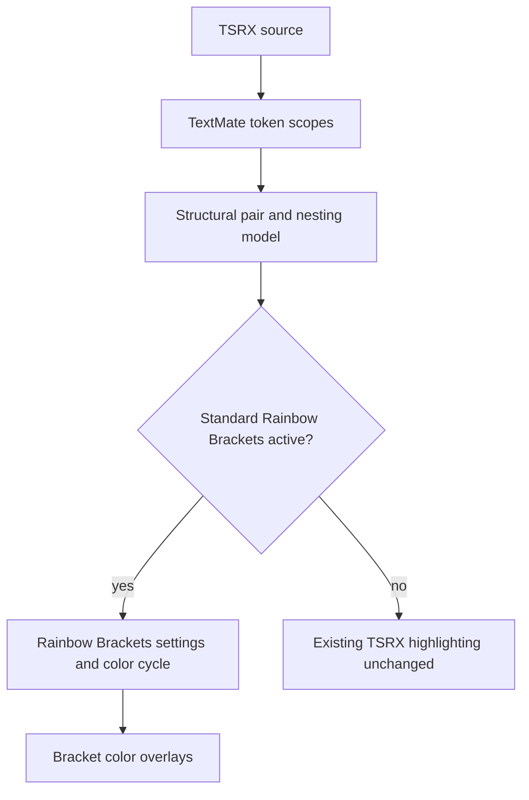
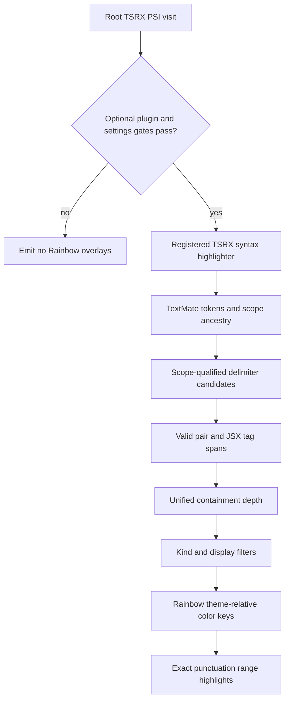
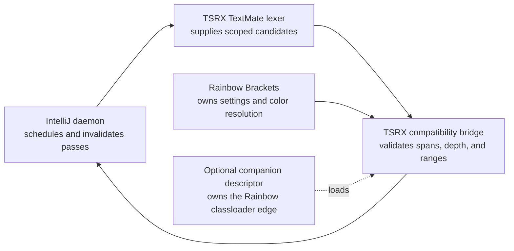

# IntelliJ Rainbow Brackets - Plan

## Goal Capsule

- **Objective:** Developers using Rainbow Brackets in WebStorm see structural delimiters in `.tsrx` files colored by nesting depth with the same controls they use for TSX.
- **Means:** Add an optional TSRX compatibility layer over the existing TextMate token stream. (KTD1, KTD3)
- **Product authority:** GitHub issue #100 and requirements R1–R10 define the intended behavior.
- **Open blockers:** None.
- **Execution profile:** Standard code plan; implementation, review, and publication belong in a child stack layer above PR #101.
- **Completion owner:** The implementing agent carries the work through verification and opens the stacked PR without merging either layer.

---

## Product Contract

### Summary

When the standard Rainbow Brackets plugin is active, structural brackets in `.tsrx` files receive nesting-based colors without changing normal TSRX syntax highlighting.
The behavior covers shared TypeScript and JSX delimiters plus TSRX template-block braces.

### Problem Frame

[GitHub issue #100](https://github.com/tsrx-org/tsrx/issues/100) reports that Rainbow Brackets works in equivalent JSX and TSX files but not in `.tsrx` files.
TSRX authors therefore lose the nesting cue precisely where template syntax combines several delimiter families.

The current IntelliJ integration supplies TextMate highlighting but no bracket structure to PSI-based visitors.
WebStorm consequently presents accurate lexical scopes while Rainbow Brackets cannot identify individual TSRX bracket pairs through its normal path.

### Key Decisions

- **Ship Rainbow Brackets separately from syntax-color parity.** (session-settled: user-directed — chosen over reopening or expanding PR #101: the feature has a distinct integration and acceptance boundary.) Governs R1, R2, R3, R4, R5, R6, R7, R8, R9, R10.
- **Target the standard Rainbow Brackets plugin.** (session-settled: user-approved — chosen over supporting both standard and Lite variants: issue #100 names the standard product and a single compatibility contract keeps the change bounded.) Governs R1, R2, R6, R8.
- **Include TSRX template-block braces.** (session-settled: user-approved — chosen over strict TSX-only coverage: `@{ ... }` is a core TSRX nesting boundary and omitting it would break the visual hierarchy.) Governs R1, R3, R5.
- **Extend the TextMate path instead of introducing partial PSI.** (session-settled: user-approved — chosen over a TSRX bracket parser or waiting for upstream TextMate support: the current lexer already distinguishes the required structural delimiters.) Governs R3, R4, R5, R6, R7, R8.

<!-- ce-section: work-relationships -->

### How This Work Fits Together

This plan covers the Rainbow Brackets follow-up from issue #100.
The surrounding work remains separately reviewable and is not a committed roadmap.

- **Syntax-color parity:** This work is stacked on PR #101 and shares its current TextMate highlighting baseline, but its user-visible result has a separate acceptance boundary.
- **Full PSI-backed semantic support:** Can proceed independently later and is not required for bracket visualization.
- **Broader editor parity:** Other editor integrations remain compatibility references rather than active delivery targets.

### Actors

- A1. TSRX author: Edits `.tsrx` components in WebStorm with the standard Rainbow Brackets plugin installed.
- A2. Rainbow Brackets: Owns user settings, bracket color keys, and the configured depth cycle.
- A3. TSRX IntelliJ plugin: Supplies structural delimiter evidence that the TextMate-backed file otherwise lacks.
- A4. Plugin maintainer: Verifies compatibility without weakening the syntax-only installation tier.

### Requirements

**Bracket behavior**

- R1. With the standard Rainbow Brackets plugin active, `.tsrx` structural delimiters must receive its nesting-based color treatment.
- R2. The integration must honor global enablement, per-bracket-kind enablement, configured color count, first-level handling, empty-pair handling, language exclusions, and large-file protection from Rainbow Brackets.
- R3. Each matched opening and closing delimiter must share one level, and nested structural pairs must advance through a deterministic color cycle.
- R4. JSX opening tags, closing tags, self-closing tags, and fragments must follow JSX nesting while comparison and type-syntax angle brackets remain untouched.
- R5. TSRX `@{ ... }` template blocks and JSX embedded-expression braces must participate in the same structural hierarchy as round, square, and ordinary curly brackets.

**Compatibility and safety**

- R6. When Rainbow Brackets is absent, disabled, or excludes TSRX, `.tsrx` highlighting must remain unchanged.
- R7. Strings, comments, text content, malformed input, and unmatched delimiters must not create unrelated color overlays or corrupt later nesting levels.
- R8. Rainbow Brackets must remain an optional integration so compatible IntelliJ products retain the existing TextMate-only installation tier.

**Evidence**

- R9. Automated evidence must cover each delimiter family, mixed nesting, JSX tag forms, TSRX template blocks, ignored lexical contexts, malformed input, relevant settings, and the plugin-absent path.
- R10. A WebStorm 2025.2.4 smoke test must compare equivalent `.tsx` and `.tsrx` nesting under one theme with a compatible standard Rainbow Brackets release.

### Key Flows

- F1. Active compatibility path
  - **Trigger:** A1 opens a `.tsrx` file while Rainbow Brackets is enabled.
  - **Actors:** A1, A2, A3
  - **Steps:** TSRX supplies structural TextMate delimiters; matched pairs receive depth levels; enabled bracket kinds use Rainbow Brackets' configured color cycle.
  - **Outcome:** Nested delimiters show stable pair colors without replacing lexical syntax roles.
  - **Covered by:** R1, R2, R3, R4, R5
- F2. Inactive compatibility path
  - **Trigger:** Rainbow Brackets is missing, disabled, excludes TSRX, or suppresses the file.
  - **Actors:** A1, A2, A3
  - **Steps:** The compatibility path declines to add overlays and leaves the existing editor highlighter in control.
  - **Outcome:** TSRX retains its current syntax highlighting and load behavior.
  - **Covered by:** R2, R6, R8
- F3. Incomplete source path
  - **Trigger:** A1 edits temporarily malformed or unmatched TSRX delimiters.
  - **Actors:** A1, A3
  - **Steps:** The integration colors only pairs it can establish and contains any incomplete nesting state.
  - **Outcome:** Unrelated later delimiters retain correct levels while the file is being edited.
  - **Covered by:** R3, R7

### Acceptance Examples

- AE1. **Covers R1, R2, R3.** Given Rainbow Brackets is enabled for round, square, and curly brackets, when a `.tsrx` expression contains `({ items: [value] })`, then each opening delimiter matches its closing delimiter and each nested pair advances through the configured colors.
- AE2. **Covers R1, R3, R4.** Given nested `<section></section>` and `<>...</>` output, when WebStorm highlights the `.tsrx` file, then each tag's opening and closing punctuation shares its JSX nesting level while a TypeScript comparison remains unchanged.
- AE3. **Covers R1, R3, R5.** Given `function View() @{ return 
{items.map((item) => {item})}
 }`, when bracket colors are applied, then the template block, embedded expressions, call parentheses, arrow parameters, and JSX tags form one stable nesting hierarchy.
- AE4. **Covers R2, R6, R8.** Given Rainbow Brackets is absent, globally disabled, excludes `tsrx`, or disables one bracket kind, when the same file opens, then the integration adds no colors outside the plugin's active settings and ordinary TSRX highlighting remains available.
- AE5. **Covers R3, R7.** Given an unmatched delimiter, a comment containing `{[(<`, and a string containing closing brackets, when the file is highlighted during editing, then those non-structural characters do not shift the level of later valid pairs.
- AE6. **Covers R9, R10.** Given equivalent nested TSX and TSRX fixtures under one WebStorm theme, when automated checks and the manual smoke test run, then pair membership, nesting progression, enabled kinds, and inactive behavior have no unexplained difference.

### Scope Boundaries

- Rainbow Brackets Lite is not supported by this delivery.
- Indent-guide coloring, scope highlighting, rainbow variables, tag-name coloring, and new Rainbow Brackets settings are excluded.
- A TSRX parser, general PSI model, and full TypeScript semantic highlighting remain separate architectural work.
- Other editors are regression boundaries, not new Rainbow Brackets targets.
- PR #101 will not be merged or otherwise expanded as part of this work.

### Dependencies / Assumptions

- The standard plugin ID `izhangzhihao.rainbow.brackets` and its public settings and color-key identities remain available across releases compatible with WebStorm 2025.2.4.
- The canonical TSRX TextMate grammar continues to distinguish structural delimiter scopes from comments, strings, text, comparisons, and type syntax.
- PR #101 remains the publication parent until its syntax-highlighting branch merges, after which the child PR can be retargeted to `main`.
- Theme-relative color identity is sufficient; the TSRX plugin does not own Rainbow Brackets' RGB values.

### Sources / Research

- [GitHub issue #100](https://github.com/tsrx-org/tsrx/issues/100) supplies the reported WebStorm comparison and desired Rainbow Brackets parity.
- `docs/plans/2026-09-12-1015-feat-intellij-tsx-syntax-highlighting-parity-plan.md` defines this work as an independent follow-up.
- `packages/intellij-plugin/README.md`, `packages/intellij-plugin/DEVELOPMENT.md`, and `packages/intellij-plugin/src/main/resources/META-INF/plugin.xml` define the current TextMate-backed IntelliJ surface and WebStorm reference build.
- `grammars/textmate/tsrx.tmLanguage.json` supplies the lexical delimiter scopes used by the compatibility boundary.
- [Rainbow Brackets source](https://github.com/izhangzhihao/intellij-rainbow-brackets) shows the PSI-leaf brace-pair visitor model and bracket color-key families.
- [JetBrains brace-matching documentation](https://plugins.jetbrains.com/docs/intellij/additional-minor-features.html#brace-matching) defines the platform's PSI and lexer brace-pair extension surface.
- [JetBrains syntax-highlighting documentation](https://plugins.jetbrains.com/docs/intellij/syntax-highlighting-and-error-highlighting.html#semantic-highlighting) defines highlight visitors as an additional coloring layer.

---

## Planning Contract

### Key Technical Decisions

- KTD1. **Run one TSRX-only `HighlightVisitor` over the registered syntax-highlighter lexer.** (session-settled: user-approved — chosen over partial PSI and an independent parser: the canonical TextMate stream already carries the required structural distinctions.) The visitor filters in `suitableForFile`, scans during the root `PsiFile` visit, emits exact-range information highlights, and returns a fresh instance from `clone`. It does not override the deprecated visitor-order API. Governs R1, R3, R4, R5, R6, R7.
- KTD2. **Establish complete structural spans before calculating or displaying levels.** Exact TextMate leaf scopes produce candidates; ordinary pairs and template substitutions form two-ended spans; JSX opening, closing, self-closing, and fragment punctuation form tag groups. Unmatched or crossing candidates are discarded before an interval-containment pass assigns depth, so invalid input cannot shift later valid structures. Governs R3, R4, R5, R7.
- KTD3. **Load Rainbow-specific code only through a uniquely named optional descriptor and capability gate.** `plugin.xml` points `izhangzhihao.rainbow.brackets` to `tsrx.intellij-plugin-rainbow-brackets.xml`; that descriptor alone registers the visitor. The registered visitor exposes no external Rainbow types and obtains its direct-link adapter through a narrow boundary that converts linkage incompatibility into a disabled TSRX overlay path. Gradle resolves Rainbow Brackets 2025.3.12 for compilation, tests, and the development sandbox without copying its JAR or classes into the TSRX distribution. Governs R1, R6, R8, R9.
- KTD4. **Treat Rainbow Brackets as the owner of settings and color resolution.** A narrow adapter snapshots settings on each pass and asks the plugin for the theme-relative key at a calculated level. The adapter applies the global, kind, first-level, empty-pair, language-blocklist, large-file, HTML-inside-JS, round-colors-for-all, mixed-cycle, and template-string controls that affect the in-scope delimiters; invalid settings or missing keys produce no overlay. Governs R2, R4, R5, R6, R7.
- KTD5. **Compute structure independently from display filtering.** When mixed-family cycling is active, every valid structural span contributes to depth even if its own kind is disabled; when it is inactive, only enclosing spans of the same family contribute. First-level and empty-pair suppression remove output, not structural depth. Self-closing JSX tags are structural rather than empty bracket pairs. Governs R2, R3, R4, R5.
- KTD6. **Keep every analysis pass stateless, linear, and cancellation-aware.** Global, blocklist, and large-file gates run before lexer acquisition. For eligible input of UTF-16 length `N`, lexer advances `T`, paired spans `P`, and JSX intervals `E`, the pass uses `O(N)` time and `O(T + P + E)` transient storage. Every token and completed span advances through source-sorted iterative stacks a bounded number of times; the analyzer never searches all intervals or ancestor lists per pair. Lexer traversal, pairing, interval assignment, and highlight emission each propagate cancellation. Invalid or non-advancing token ranges fail closed, and no source ranges, PSI/editor references, settings, or resolved keys survive the pass. Governs R2, R6, R7, R8.

### High-Level Technical Design

This non-prescriptive sketch shows the required ownership and information flow; KTD1–KTD6 own the implementation rules.

The structural model has two outputs: a containing source span used for depth and one or more punctuation ranges that receive the color key. An ordinary pair exposes its opening and closing ranges. A paired JSX element or fragment exposes both opening-tag and closing-tag punctuation at one element depth, while a self-closing tag exposes its begin and `/>` ranges.

| Runtime state | Analysis path | Depth source | Display result |
| --- | --- | --- | --- |
| Rainbow Brackets absent | Optional descriptor is not loaded. (KTD3) | None | Baseline TSRX highlighting only. |
| Present but globally disabled | Stop before lexer acquisition. (KTD4, KTD6) | None | No Rainbow overlays. |
| Present but the language or file is excluded | Stop before lexer acquisition. (KTD4, KTD6) | None | No Rainbow overlays. |
| Eligible, mixed-family cycle | Build all valid structures before filtering. (KTD2, KTD5) | Every valid enclosing span | Emit only enabled kinds; filtering does not renumber descendants. |
| Eligible, per-family cycle | Build all valid structures before filtering. (KTD2, KTD5) | Valid enclosing spans of the same family | Emit only enabled kinds; filtering does not renumber descendants. |

### Implementation Constraints

- Classify by exact leaf scope and required ancestry, never by raw character alone. This keeps comments, strings, text content, comparisons, generic/type angles, and JSDoc punctuation outside the model.
- Reuse `SyntaxHighlighterFactory` and the generic lexer interface. Do not instantiate TextMate lexer implementations, matcher registries, editor highlighters, `LeafPsiElement`, or plain-text PSI implementation classes.
- Keep direct `RainbowSettings` and `RainbowHighlighter` references inside the optional adapter implementation. The registered visitor and every main-descriptor class remain externally untyped and loadable when Rainbow is absent or API-incompatible. (KTD3)
- Use the current grammar as an input contract. Change `grammars/textmate/tsrx.tmLanguage.json` only if an executable fixture proves an in-scope delimiter lacks a structural scope.
- Color multi-character punctuation such as `${`, `</`, and `/>` as the lexer exposes it; never color tag names or the `@` in `@{`.
- Treat comments inside an ordinary pair as content for the empty-pair setting; only whitespace-only ordinary round, square, curly, or template-substitution spans are empty.
- A large file is suppressed only when its line count is greater than the configured threshold. Equality remains eligible.
- Match language-blocklist entries case-insensitively against `TSRX` and `tsrx` identities.

### Sequencing and Delivery

1. Characterize scope-to-candidate conversion and structural recovery before registering an editor extension.
2. Add the optional runtime boundary and settings/color adapter after analyzer behavior is stable.
3. Prove real editor overlays and packaging optionality before changing user documentation.
4. Publish the complete change as one child layer rooted at PR #101's verified head commit. The GitHub stack extension is a publication prerequisite; absence must stop stack submission rather than flatten the child into an ordinary PR.

### System-Wide Impact

**Ownership and entry points**

- IntelliJ's highlighting daemon owns pass scheduling, invalidation after document or settings changes, and disposal.
- The registered TSRX syntax highlighter owns TextMate tokenization; the compatibility bridge owns candidate validation, structural depth, and exact punctuation ranges. (KTD1, KTD2)
- Rainbow Brackets owns enablement, exclusions, bracket-family keys, and theme-relative color resolution. (KTD4, KTD5)
- The companion descriptor is the only load edge allowed to register code that directly references Rainbow Brackets classes. The always-loaded file type, syntax highlighter, and LSP tier remain independent. (KTD3)

**Highlighting lifecycle and state**

Each eligible root-file visit builds one complete pass-local model from the current file snapshot, emits overlays during that visit, and releases its holder and model when the pass ends. It relies on normal daemon invalidation to replace, rather than accumulate, ranges after edits or setting changes. The implementation adds no document listeners, caches, services, or disposal responsibilities. (KTD1, KTD6)

**Failure behavior**

| Condition | Boundary behavior | Observable result |
| --- | --- | --- |
| Rainbow Brackets is absent | The platform does not load the companion descriptor. (KTD3) | TSRX parsing and highlighting follow the existing baseline. |
| Rainbow is disabled or the file is excluded | Eligibility gates stop before lexer acquisition. (KTD4, KTD6) | The pass emits no Rainbow ranges. |
| Input is malformed or tokenization is incomplete | Invalid candidates do not enter the structural model. (KTD2) | Independent valid structures can still receive stable levels. |
| The daemon cancels the pass | Every long-running loop propagates cancellation. (KTD6) | No pass state or partial cache survives. |
| Settings or color data is invalid | The adapter rejects the affected overlay. (KTD4) | Baseline highlighting remains available. |
| The external API is incompatible | Narrow compatibility failures at the optional boundary fail closed; unrelated failures are not broadly swallowed. | Plugin Verifier or daemon diagnostics expose the defect without moving Rainbow code into TSRX parsing or file-type registration. |

**Performance envelope**

Because current TSRX PSI invalidates as one file-spanning leaf, an eligible edit may repeat the whole-file pass without amortization. KTD6 owns the linear time and transient-memory bounds. Verification must cover flat delimiter density, maximum nesting, adjacent JSX groups, and malformed unmatched input at comparable `N` and `2N` sizes; test-only operation counts must grow by a bounded constant factor, not quadratically. A just-over-threshold file must stop before lexer acquisition. The manual smoke uses a representative just-under-threshold file to check rapid edits and setting toggles for UI stalls, stale overlays, retained pass data, or dominant substring/per-character allocation churn. No cross-pass cache or benchmark harness belongs in this delivery unless that evidence reveals a regression.

**Packaging and release**

The IntelliJ artifact ships the optional descriptor and dependency metadata but no Rainbow Brackets JAR or classes. The base plugin remains installable and loadable without the external plugin; the supported ID and verified API version are recorded as compatibility assumptions rather than bundled behavior. This marketplace-visible change receives the repository's normal IntelliJ patch changeset. (KTD3, R8)

| Impact claim | Owning evidence |
| --- | --- |
| Optional classloading and unbundled packaging | Descriptor and archive tests in U3 |
| Eligibility and settings ownership | Adapter/visitor matrix in U2 and real-plugin checks in U3 |
| Mixed and per-family depth stability | Analyzer assertions in U1 and editor assertions in U3 |
| Edit invalidation and pass-local state | Same-session transition tests in U3 |
| Malformed input, cancellation, and linear work | Recovery, cancellation, and operation-bound tests in U1 |

### Risks and Dependencies

- **Third-party API drift:** Rainbow Brackets exposes the required 2025.3.12 classes publicly but does not document them as a stable plugin API, and IntelliJ descriptors cannot constrain a non-bundled dependency by version. Isolate the calls, pin compatibility tests, keep failures non-fatal where a call can be guarded, and let Plugin Verifier report linkage problems instead of suppressing them.
- **TextMate scope drift:** The grammar is the structural source of truth but is generated and can evolve. Actual-scope tests must fail when delimiter identity or ancestry changes.
- **Whole-file invalidation cost:** TSRX currently has one plain-text PSI leaf, so edits re-run the file scan. Pre-lex gates, a single pass, iterative pairing, and cancellation are required; performance work beyond the configured large-file boundary is deferred.
- **Stack parent movement:** PR #101 can advance while the child is being built. Publication must re-resolve the parent PR by number and preserve the child diff against its current head without rewriting published parent history.

### Planning Research Anchors

- `packages/intellij-plugin/src/main/kotlin/dev/tsrx/intellij_plugin/TsrxSyntaxHighlighterFactory.kt` is the current TextMate lexer and scope-ancestry pattern.
- `packages/intellij-plugin/src/test/kotlin/dev/tsrx/intellij_plugin/TsrxSyntaxHighlightingTest.kt` demonstrates actual token capture and semantic-key inspection in platform tests.
- `packages/intellij-plugin/src/test/kotlin/dev/tsrx/intellij_plugin/TsrxPluginPackagingTest.kt` owns optional-descriptor and packaged-resource assertions.
- [JetBrains plugin-dependency documentation](https://plugins.jetbrains.com/docs/intellij/plugin-dependencies.html#optional-plugin-dependencies) defines optional descriptor loading and classloader isolation.
- [IntelliJ Platform Gradle dependency documentation](https://plugins.jetbrains.com/docs/intellij/tools-intellij-platform-gradle-plugin-dependencies-extension.html#non-bundled-plugin) defines the non-bundled Marketplace plugin dependency.
- [JetBrains semantic-highlighting guidance](https://plugins.jetbrains.com/docs/intellij/syntax-highlighting-and-error-highlighting.html#semantic-highlighting) defines the additional range/key coloring layer.
- Rainbow Brackets 2025.3.12 supplies the verified settings getters, bracket-family constants, and theme-relative color resolver for WebStorm build 252.
- No applicable repository learning or configured Compound Pack constrains this work.

---

## Implementation Units

### U1. Build the TextMate structural analyzer

- **Goal:** Convert the current TSRX token stream into valid, nested delimiter and JSX tag groups without editor or Rainbow state.
- **Requirements:** R3, R4, R5, R7, R9; F3; AE1, AE2, AE3, AE5.
- **Dependencies:** None.
- **Files:**
  - Create `packages/intellij-plugin/src/main/kotlin/dev/tsrx/intellij_plugin/TsrxRainbowBracketAnalyzer.kt`.
  - Create `packages/intellij-plugin/src/test/kotlin/dev/tsrx/intellij_plugin/TsrxRainbowBracketAnalyzerTest.kt`.
- **Approach:**
  1. Drive the registered TSRX syntax highlighter and reduce TextMate tokens to scope-qualified delimiter candidates under KTD1.
  2. Build ordinary, template-substitution, and JSX tag groups under KTD2, retaining containing spans separately from punctuation ranges.
  3. Assign mixed-family and per-family levels through valid interval containment under KTD5.
  4. Keep candidate classification and pairing data internal and independent from Rainbow Brackets classes so recovery tests stay deterministic.
- **Execution note:** Start with characterization tests for real TextMate scope chains, then lock pairing and malformed-input recovery before adding the editor visitor.
- **Patterns to follow:** Mirror `TsrxSyntaxHighlighter` scope walking and the synthetic `TextMateScope` helpers in `TsrxSyntaxHighlightingTest`.
- **Test scenarios:**
  - Covers AE1. Nested `({ items: [value] })` yields matched round, curly, and square groups with deterministic mixed and per-family depths.
  - Covers AE2. Paired JSX elements, self-closing tags, and fragments expose only tag punctuation ranges at element depth; comparison and generic/type angles produce no group.
  - Covers AE3. A TSRX `@{}` block containing JSX, an embedded expression, a call, and a nested tag yields one valid containment hierarchy.
  - Template literal text containing bracket characters is ignored, while a `${...}` substitution is classified as a curly structure only when its exact scopes are present.
  - String, line-comment, block-comment, JSX text, and JSDoc bracket characters produce no candidates.
  - Covers AE5. Unmatched openers, unmatched closers, crossed kinds, malformed tags, and an incomplete fragment do not alter the depth of a later valid pair.
  - Empty and whitespace-only ordinary pairs are marked empty; pairs containing a comment are not.
  - A cancellation request during a long token stream exits promptly without retained analyzer state.
  - Flat delimiter density, maximum nesting, adjacent JSX groups, and malformed unmatched input at comparable `N` and `2N` sizes grow lexer, comparison, and stack-operation counts by a bounded constant factor.
- **Verification:** Analyzer output names every expected punctuation range and level for the fixture matrix, all negative characters are absent from the model, and `N`/`2N` operation counts remain within the declared linear bound.

### U2. Add the optional Rainbow runtime boundary

- **Goal:** Activate TSRX range overlays only when the standard Rainbow Brackets plugin is present and its current settings permit them.
- **Requirements:** R1, R2, R6, R8, R9; F1, F2; AE1, AE4.
- **Dependencies:** U1.
- **Files:**
  - Create `packages/intellij-plugin/src/main/kotlin/dev/tsrx/intellij_plugin/TsrxRainbowBracketsAdapter.kt`.
  - Create `packages/intellij-plugin/src/main/kotlin/dev/tsrx/intellij_plugin/TsrxRainbowBracketsHighlightVisitor.kt`.
  - Create `packages/intellij-plugin/src/main/resources/META-INF/tsrx.intellij-plugin-rainbow-brackets.xml`.
  - Modify `packages/intellij-plugin/src/main/resources/META-INF/plugin.xml`.
  - Modify `packages/intellij-plugin/build.gradle.kts`.
  - Create `packages/intellij-plugin/src/test/kotlin/dev/tsrx/intellij_plugin/TsrxRainbowBracketsHighlightVisitorTest.kt`.
- **Approach:**
  1. Add Rainbow Brackets 2025.3.12 as a non-bundled IntelliJ development dependency and declare its plugin ID optional under KTD3.
  2. Register the visitor only in the companion descriptor and keep the main dependency tier unchanged.
  3. Snapshot settings once per root-file visit, apply KTD4 and KTD6 gates, and ask the adapter for the current scheme's family key.
  4. Emit information highlights only during the real `PsiFile` visit, then clear holder and pass state in `finally`.
- **Patterns to follow:** Follow the existing `plugin.xml` to `tsrx-ultimate.xml` optional tier and the holder lifecycle used by build-252 `HighlightVisitor` implementations.
- **Test scenarios:**
  - Covers AE4. A missing or unavailable adapter produces no highlights and does not invoke the analyzer.
  - A linkage-incompatible adapter is rejected by the capability boundary without preventing the visitor or baseline TSRX highlighting from loading.
  - Global disablement, `tsrx` blocklisting, and a file above the enabled line threshold produce no highlights before lexing.
  - Each disabled bracket kind suppresses only that family's ranges while structural depth remains stable.
  - First-level and whitespace-only suppression remove the selected ranges without changing descendant levels.
  - Round-colors-for-all changes the requested color family without changing per-kind enablement.
  - Mixed-cycle enabled uses unified depth; disabled uses per-family depth.
  - HTML-inside-JS and template-string settings suppress only their corresponding JSX or substitution ranges.
  - Zero or negative color count and a missing color key fail closed without throwing.
  - The visitor accepts only `TsrxLanguage`, runs once at the root, observes cancellation, and clears pass state after success or failure.
- **Verification:** With a fake adapter, exact ranges receive only the expected family/level requests for every settings branch, and the no-op paths perform no scan or emission.

### U3. Prove editor, packaging, and edit-transition behavior

- **Goal:** Demonstrate that the real standard plugin colors TSRX ranges while the built TSRX artifact remains independently loadable.
- **Requirements:** R1, R2, R3, R4, R5, R6, R7, R8, R9, R10; F1, F2, F3; AE1–AE6.
- **Dependencies:** U1, U2.
- **Files:**
  - Create `packages/intellij-plugin/src/test/kotlin/dev/tsrx/intellij_plugin/TsrxRainbowBracketsHighlightingTest.kt`.
  - Create `packages/intellij-plugin/src/test/resources/highlighting/rainbow-brackets.tsrx`.
  - Modify `packages/intellij-plugin/src/test/kotlin/dev/tsrx/intellij_plugin/TsrxPluginPackagingTest.kt`.
- **Approach:**
  1. Load the real Marketplace dependency in platform tests and inspect forced attribute-key identities and source ranges after `doHighlighting()`.
  2. Exercise enabled-to-disabled and valid-to-malformed edits in one fixture session to prove stale overlays disappear.
  3. Extend descriptor assertions for the optional dependency and companion visitor registration.
  4. Inspect the built archive to prove it contains the companion descriptor but no Rainbow Brackets JAR or classes.
- **Patterns to follow:** Reuse `TsrxSyntaxHighlightingTest` fixture loading, occurrence probes, and external-name assertions; extend `TsrxPluginPackagingTest` XML helpers rather than duplicating descriptor parsing.
- **Test scenarios:**
  - A direct snapshot of the real plugin settings maps the verified external API to the adapter contract.
  - Covers AE1–AE3. One representative mixed fixture proves configured color wrap and matching keys across `@{}`, ordinary pairs, JSX elements, self-closing tags, fragments, and embedded expressions while leaving tag names and comparison/type angles untouched.
  - Covers AE4. One global-disable transition removes prior overlays in the same editor session; the exhaustive settings matrix remains in U2.
  - Covers AE5. One valid-to-malformed edit removes invalid prior ranges, preserves an independent valid pair's level, and adds no overlays for comments, strings, or template literal text.
  - The main descriptor keeps Rainbow optional, the companion descriptor has one visitor, and the built archive has no bundled Rainbow implementation.
- **Verification:** Platform assertions prove the real 2025.3.12 adapter contract on WebStorm 2025.2.4, and packaging evidence proves the baseline installation tier remains independent.

### U4. Document compatibility and release the package change

- **Goal:** Make the optional integration, verified versions, smoke procedure, and package impact explicit to users and maintainers.
- **Requirements:** R2, R7, R8, R9, R10; AE4, AE5, AE6.
- **Dependencies:** U2, U3.
- **Files:**
  - Modify `packages/intellij-plugin/README.md`.
  - Modify `packages/intellij-plugin/DEVELOPMENT.md`.
  - Create a new `.changeset/*.md` patch entry for `@tsrx/intellij-plugin` only.
- **Approach:**
  1. Describe Rainbow Brackets as an optional standard-plugin enhancement and name the verified WebStorm and plugin versions.
  2. Extend the install-from-disk smoke procedure with clean-profile absent and installed passes, settings checks under R2, malformed-edit checks under R7, and the equivalent TSX/TSRX comparison under R10.
  3. Record the user-facing IntelliJ package change without modifying the parent PR's existing changeset.
- **Patterns to follow:** Match the current feature, requirements, smoke-test, and private-package Changesets language in the same files.
- **Test scenarios:**
  - Documentation names the standard plugin rather than Lite and does not imply Rainbow is required for baseline syntax support.
  - The smoke procedure uses a representative just-under-threshold file for rapid edits and setting toggles, recording any UI stall, stale overlay, retained pass data, or dominant substring/per-character allocation churn.
  - The changeset bumps only `@tsrx/intellij-plugin` at patch level.
- **Verification:** A maintainer can reproduce the absent/present and near-threshold responsiveness smoke from the documented fixtures and settings, and changeset validation recognizes the new package entry.

---

## Verification Contract

| Gate | Command or evidence | Units | Required outcome |
| --- | --- | --- | --- |
| Focused platform suite | `packages/intellij-plugin/gradlew -p packages/intellij-plugin test` | U1, U2, U3 | Analyzer, visitor, real-plugin, edit-transition, and packaging tests pass. |
| IntelliJ release contract | `pnpm test --project intellij-plugin` | U2, U3, U4 | The package, workflow, version, and Marketplace-release invariants remain valid. |
| Full IntelliJ CI parity | `node scripts/sync-intellij-plugin-version.js --check` followed by the Gradle `test verifyPluginProjectConfiguration buildPlugin verifyPluginStructure verifyPlugin` gate | U2, U3, U4 | Build 252 compilation, structure checks, archive creation, and Plugin Verifier pass without ignored Rainbow linkage failures. |
| Repository quality | `pnpm format:check` and `pnpm changeset:check` | U1–U4 | Formatting and patch-release policy pass without changing parent-PR artifacts. |
| Archive inspection | Built ZIP contents and `TsrxPluginPackagingTest` | U2, U3 | Optional descriptor is present; Rainbow Brackets JARs/classes are absent; baseline dependencies stay required-only. |
| Manual WebStorm smoke | WebStorm 2025.2.4, Rainbow Brackets 2025.3.12, `rainbow-brackets.tsrx`, an equivalent TSX fixture, and a representative just-under-threshold file | U3, U4 | Absent mode preserves baseline highlighting; present mode shows the documented family/depth sequence; settings and malformed edits update without stale overlays; rapid edits show no UI stall, retained pass state, or dominant avoidable allocation churn. |
| Stacked delivery | Stack topology and child PR diff | U1–U4 | The child is rooted at PR #101's verified head, contains only Rainbow work relative to its parent, is ready for review, and neither PR is merged. |

Plugin Verifier may require network access to resolve the declared optional Marketplace dependency. Do not add external-package suppressions to turn a linkage failure into a passing report.

---

## Definition of Done

### Global Completion

- Every requirement R1–R10 has automated or manual evidence in the Verification Contract.
- The standard Rainbow Brackets plugin colors only validated TSRX structural punctuation and honors every in-scope setting under the documented reference versions.
- Baseline TSRX file type, TextMate highlighting, and optional LSP behavior remain available with Rainbow Brackets absent or disabled.
- The built plugin declares Rainbow Brackets optional and does not bundle third-party implementation code.
- The IntelliJ-focused patch changeset, user documentation, and maintainer smoke instructions are complete.
- Focused tests, the full IntelliJ CI-equivalent gate, formatting, changeset validation, and Plugin Verifier all pass.
- The review-ready child PR is stacked on PR #101 and reports any unavoidable CI limitation without merging either layer.
- Abandoned experiments, temporary proof hooks, generated scratch files, and debug logging are absent from the final diff.

### Per-Unit Completion

| Unit | Done signal |
| --- | --- |
| U1 | Actual-scope characterization and structural-model tests cover every delimiter family, valid nesting, ignored contexts, recovery, cancellation, and bounded `N`/`2N` operation growth. |
| U2 | The optional visitor and adapter cover the full settings matrix and produce no work on inactive paths. |
| U3 | Real-plugin platform tests, edit transitions, descriptors, and archive contents prove active and baseline modes. |
| U4 | README, development smoke instructions including the near-threshold responsiveness pass, and the IntelliJ-only patch changeset match shipped behavior. |
